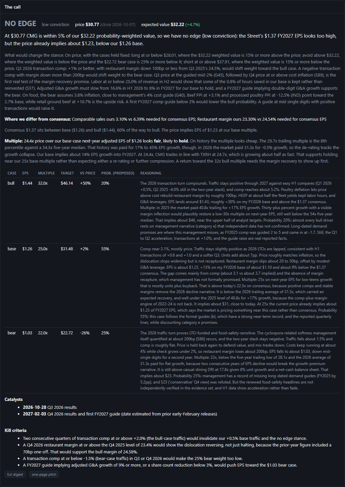
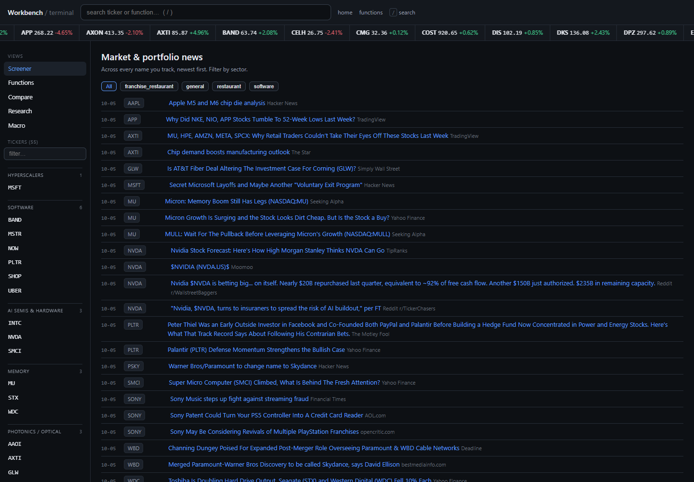
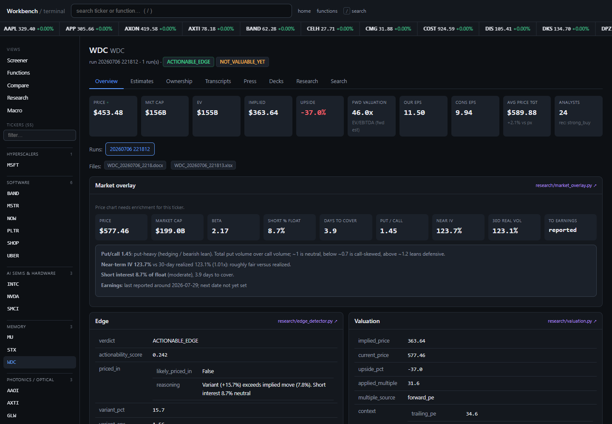
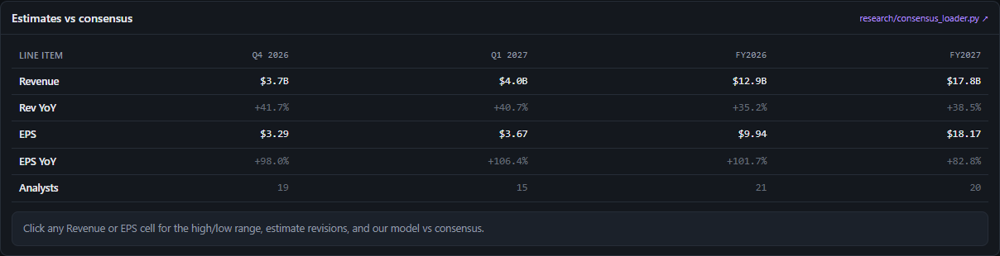
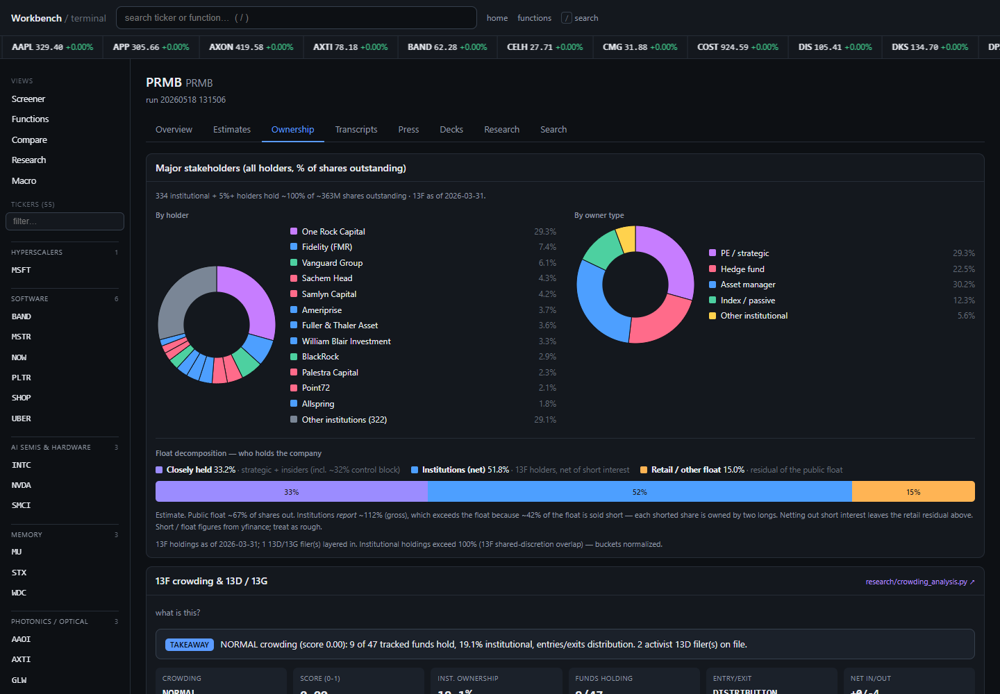
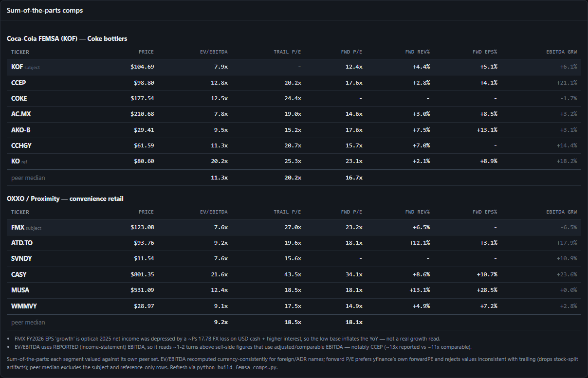
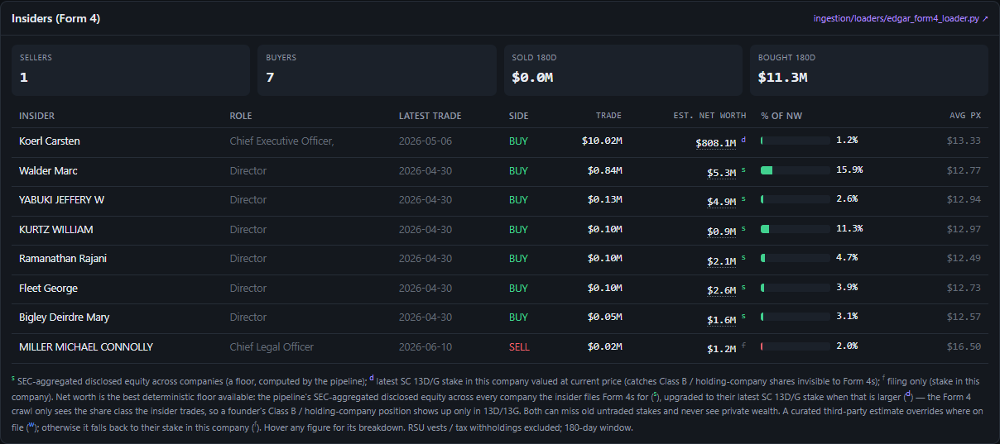
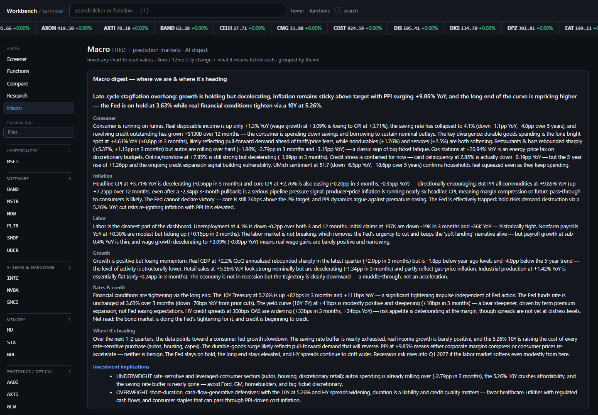
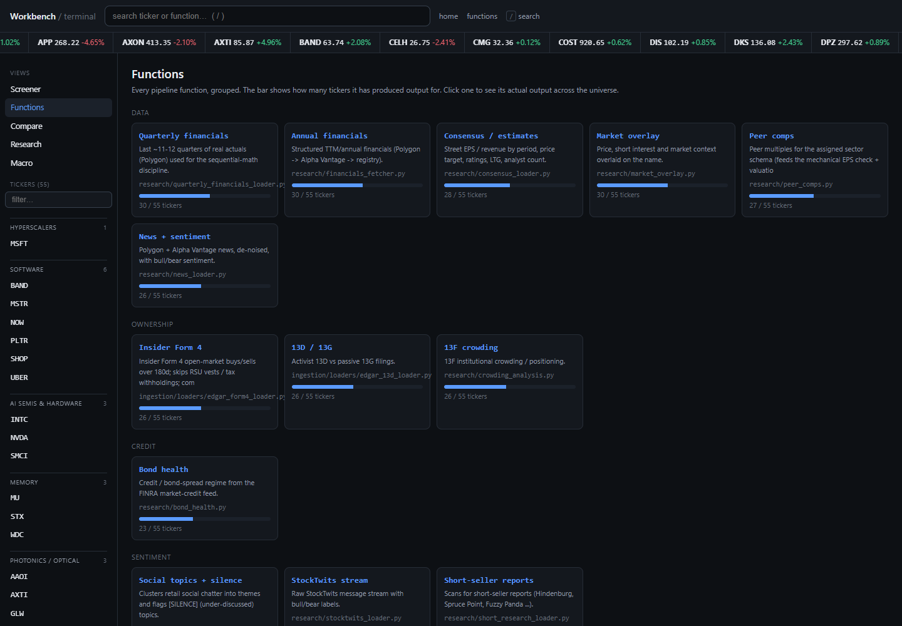

# Investment Workbench

A single-analyst equity research system. Give it a ticker and it pulls the public record on the company (financials, SEC filings, investor decks, consensus, ownership, insider trades, news, social chatter, macro), has Claude write an edge-seeking research brief over all of it, fact-checks the brief's claims against the sources, builds a driver-based EPS estimate, compares that estimate to consensus, and ends with a call: long, short, avoid or no edge, from bull/base/bear cases it computes bottom-up from the company's reported cost lines. It writes a full digest, a one-page pitch and Word/Excel deliverables. A local dashboard sits on top of everything the pipeline has produced.

**[Browse the demo →](https://danieldrewgold.github.io/investment-workbench/)** A read-only snapshot of the dashboard with real output on 55 covered names: every company page, estimates, ownership, transcripts, press, decks, the function inspector, and macro. Prices are frozen at the snapshot date, and Search / Ask AI are off because they need the live server.

About 62,000 lines of Python across 157 files.

```bash
python cli.py research WDC --verbose
python dashboard.py            # http://127.0.0.1:8765
```

The design goal is not "summarize the company." It is "find where the market is wrong, prove it with sourced numbers, and carry it through to EPS." Every pitch the system produces is held to five tests: prove the gap, end at EPS, source every number rather than triangulating it, make it two-sided and dated, and explain why the mispricing exists.

---

## Walkthrough

### The call
Each run ends with a stance and the numbers behind it. Claude proposes the scenario inputs: traffic, price, cost inflation by line, multiples and probabilities. Code then builds bull/base/bear EPS from the company's reported cost lines and computes targets, the probability-weighted value, the stance (against a 15% hurdle), and the price levels at which the stance would change. It also shows where consensus falls in that range and what consensus needs (for Chipotle, a 24.5% restaurant margin that rests on an untested management promise). Management is treated as a biased source. Guidance is scored against reported results, and its claims are classed by how much they can be trusted. A second Claude pass writes the narrative around the computed numbers and cannot change them. Example: the [one-page CMG pitch](docs/call-redesign/CMG_pitch_example.md); method and before/after in [CHANGES.md](CHANGES.md).



### Home: the covered universe
Every ticker that has been run, grouped by theme, with a live price tape and the screener/compare/macro views in the sidebar.



### Company overview
One page per name: price chart, market cap and enterprise value, the latest research brief, consensus, valuation, peer comps, ownership, insiders, press releases and investor decks. Each panel links to the source module that produced it.



### Estimates vs consensus
Street revenue and EPS by quarter and fiscal year with analyst counts. Clicking a cell shows the high/low range, recent estimate revisions, and the model's own number next to consensus.



### Ownership
13F institutional holders, 13D/13G activist and passive stakes, and crowding (how concentrated and how consensus-long the holder base is).



### Sum-of-the-parts comps
For conglomerates, segment-level comp tables valued against the right peer set. FEMSA, for example, is split into its Coca-Cola bottling stake (vs. global bottlers) and OXXO (vs. convenience retail), with currency and unit normalization and footnotes on any multiple that needed adjusting.



### Insiders
Form 4 open-market buys and sells over 180 days, with each trade sized against the insider's estimated net worth. Net worth is a deterministic floor built from SEC filings (aggregated Form 4 holdings across every company the insider files for, upgraded to the latest 13D/13G stake when that is larger), so a founder's holding-company shares are not missed.



### Macro
Rates, credit, labor, and inflation from FRED/BLS/BEA, plus the bond-market health read used as context in each brief.



### Function inspector
Every pipeline step, grouped, with how many tickers it has produced output for. Click into one to see its raw output across the whole universe, which is how data-quality problems get caught.



---

## What the pipeline does

`python cli.py research <TICKER>` runs a dependency graph (`research/dag/steps.py`). Fetch steps run in parallel; analysis steps wait on what they need.

| Layer | Steps |
|---|---|
| Fundamentals | annual + quarterly financials (Polygon, Alpha Vantage fallback, yfinance for foreign ADRs with currency conversion), consensus estimates, peer comps |
| Filings | 8-K earnings press releases (EDGAR Exhibit 99.x), company IR-site press releases and investor decks, 13D/13G, Form 4, 8-K Item 2.05 restructuring + state WARN notices |
| Market | price/short interest/options overlay, 13F crowding, news with sentiment, StockTwits and social-topic clustering, short-seller reports |
| Macro / credit | FRED, BLS, BEA, FINRA TRACE bond health |
| Synthesis (Claude) | transcript digest, investor-deck vision analysis, guidance extraction, corpus assembly, research brief, claim verification |
| Model | driver-based EPS bridge, adversarial review, edge vs. consensus, valuation, decision gate |
| Call | last close (never inferred), guidance track record and management-statement ledger, cost-line scenarios, expected value vs. a 15% hurdle, stance and the price levels that would change it (`research/call/`) |
| Output | JSON results under `data/`, digest + one-page pitch, Word report, Excel workbook |

Batch mode: `python cli.py scan WDC,STX,MU` (or `--all`). `python cli.py dag <TICKER>` runs just the fetch/analysis graph. See [ARCHITECTURE.md](ARCHITECTURE.md) for module-level detail.

---

## Setup

Developed on Python 3.14 on Windows; should run on 3.11+.

```bash
pip install -r requirements.txt
cp .env.example .env          # then fill in keys
python cli.py research COST --verbose
python dashboard.py
```

Only `ANTHROPIC_API_KEY` is required. Everything else degrades gracefully when its key is missing: the step logs that it was skipped and the brief is written from whatever data is available. SEC EDGAR needs no key but does require a real contact in `SEC_USER_AGENT`.

`data/` is gitignored (it holds caches, run outputs, and licensed content), so a fresh clone starts with an empty dashboard. Run a ticker or two first.

**How to use it day to day** (commands, refresh scripts, what each dashboard tab is for): see [docs/USAGE.md](docs/USAGE.md). On Windows, `start_dashboard.bat` launches the dashboard with a double-click.

---

## Known limitations

- **Earnings-call transcripts are currently off.** The paid transcript provider (EarningsCall.biz) subscription has lapsed. Without `ECALL_API_KEY`, the transcript step falls back to Yahoo for a small seeded set of names and otherwise runs empty, so briefs lean more on press releases, decks and filings than they were designed to.
- **The bottom-up call covers restaurants only so far.** Scenario drivers live in a per-industry config (`research/call/schemas/restaurant.json`). Names without one still get a call, but its scenario EPS is proposed by the model rather than built from cost lines. Scenario probabilities are the model's proposals, not calibrated, and can be overridden per name in `data/overrides/<T>.json`.
- **Mechanical EPS for unfamiliar business models.** Names that don't fit one of the sector schemas get a general schema, and the mechanical EPS check is looser there than for, say, restaurants or semis.
- **Free-tier rate limits.** Polygon's free tier allows about five requests a minute, so a cold first run on a new ticker is slow.
- **Not investment advice.** This is a research tool; its numbers should be checked against the filings before being relied on.

---

## Roadmap

- **Live hosted version.** The demo is a static export (`python scripts/export_static.py site` against a running dashboard). Hosting the live server, with real-time prices, search, Ask AI and on-demand runs, is deferred until the product earns it: it needs a login and server-side keys.
- Integrated three-statement model with a drivers tab and multi-period forecasts.
- A replacement transcript source.
